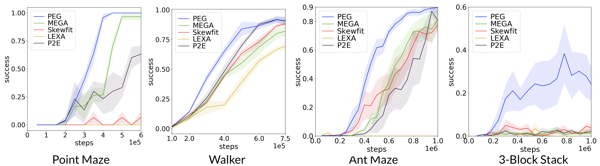

# 🌎 Planning Goals for Exploration
The official implementation of the Planning Exploratory Goals (PEG) agent, an unsupervised RL agent for hard exploration tasks.


This codebase provides:
- PEG, an unsupervised RL agent that explores by choosing goals with a world model.
- 4 hard exploration environments.
- Model-based RL versions of [SkewFit](https://arxiv.org/abs/1903.03698) and [MEGA](https://arxiv.org/abs/2007.02832), alternative goal-cond. exploration approaches.
- State-input version of the [LEXA](https://arxiv.org/abs/2110.09514) model-based RL agent, which was designed for image-input tasks.

If you find our paper or code useful, please reference us:
```
@article{hu2023planning,
  title={Planning Goals for Exploration},
  author={Edward S. Hu and Richard Chang and Oleh Rybkin and Dinesh Jayaraman},
  booktitle={The Eleventh International Conference on Learning Representations},
  year={2023},
  url={https://openreview.net/forum?id=6qeBuZSo7Pr}
}
```
To learn more:
- [Research Paper](https://openreview.net/forum?id=6qeBuZSo7Pr)
- [Website](https://sites.google.com/view/exploratory-goals)
- [OpenReview](https://openreview.net/forum?id=6qeBuZSo7Pr)

## Planning Exploratory Goals

PEG explores by choosing goals for Go-Explore style exploration, where an exploration policy is launched from the terminal state of a goal-conditioned policy rollout. PEG plans these exploratory goals through a world model, directly optimizing for exploration value.


PEG outperforms both goal-directed and non-goal-directed exploration approaches across a variety of tasks.


## Quickstart
To get PEG up and running, we will first install core dependencies for the PEG agent and then some environments. Then we will quickly test PEG out on the Point Maze env. After installation, your directory should look something like:

```
projects/
  |- peg/              # PEG agent
  |- mrl/              # Point Maze, Ant Maze, 3-block stack envs
  |- lexa-benchmark/   # Walker env's high level code
  |- dm_control/       # Walker env's low level code
```

### Step 1/3: PEG installation
We run PEG on Ubuntu 20.04 machines with Nvidia 2080ti GPUs. PEG is efficient, requiring only 1 GPU.

We recommend using Conda to manage the dependencies. The core software dependencies are:
- Python 3.6: It is important to use Python 3.6 to be compatible with the Walker environment.
- Tensorflow 2.4: For neural network training. We use TF2's jit and mixed float precision to speed up training.


Create the conda environment by running:
```
conda env create -f environment.yml
```
Then navigate to the `peg` folder and set it up as a local python module
```
# in the peg folder, like /home/edward/peg/
pip install -e .
```


### Step 2/3: Environment installation
We evaluate PEG on four environments: Point Maze, Walker, Ant Maze, and 3-block Stack.

3/4 of the environments (Walker, Ant Maze, 3-Block Stack) use [MuJoCo 2.0](https://www.roboti.us/download.html), so install that if you want to use these environments. If you're just doing the quickstart, you can ignore this since we will be using Point Maze which does not need MuJoCo.

#### Point Maze, Ant Maze, 3-Block Stack
The `mrl` codebase contains the Point Maze, Ant Maze, and 3-block Stack environments.
```bash
git clone https://github.com/hueds/mrl.git
```


### Step 3/3: Test PEG out
Now we will try running PEG in the Point Maze environment just to see if our installation is successful.

First, make sure the conda env is activated, and that the `mrl` path is set in the `PYTHONPATH`.
```bash
conda activate peg
# if you want to run environments in the mrl codebase like Point Maze
export PYTHONPATH=<path to your mrl folder like "/home/edward/mrl">
```

Now, we are ready to run PEG in the Point Maze environment for 10,000 steps. This script should take ~2-3 minutes to run.
```bash
python examples/run_goal_cond.py --configs peg_point_maze test_maze  --jit True  --logdir ~/logdir/test_peg_maze
```

Now, open up the tensorboard to see the results.
```bash
tensorboard --logdir ~/logdir/test_peg_maze
```
You should see training outputs in the "Scalars" tab and "Images" tab. More details on these in the "Visualization and Checkpointing" section.

**You are now done with the quick start.**

### Bonus Step: Remaining Environments
#### Walker
We will install `lexa-benchmark` and `dm_control` codebases. `dm_control` contains the actual Walker environment, and `lexa-benchmark` defines the various goals and wraps the Walker environment.

First, clone the `lexa-benchmark` and `dm_control` repos.

```bash
git clone https://github.com/hueds/dm_control
git clone https://github.com/hueds/lexa-benchmark.git
```

Set up `dm_control` as a local python module:
```bash
cd dm_control
pip install . # we omit the -e flag in this case (https://github.com/deepmind/dm_control/issues/6)
```

Now, we are ready to run the Walker env. First, make sure the conda env is activated, and that the `PYTHONPATH` is set to the `lexa-benchmark` path.
```bash
conda activate peg
# if you want to run environments in the lexa-benchmark codebase
export PYTHONPATH=<path to your lexa-benchmark folder like "/home/edward/lexa-benchmark">
```

Now, try running PEG in the Walker environment.
```bash
python examples/run_goal_cond.py --configs peg_walker test_walker  --jit True  --logdir ~/logdir/test_peg_walker
```
This script should take ~3 minutes to run. Once it's finished, open up tensorboard and checkout the outputs. You should see things in the Scalars tab and Images tab.
```bash
tensorboard --logdir ~/logdir/test_peg_walker
```
**Walker Gotchas:** The Walker env depends on `dm_control`, which requires some additional env vars about rendering to get it to run. I had to set `LD_PRELOAD` to the libGLEW path, and set the `MUJOCO_GL` and `MUJOCO_RENDERER` variables. You may need to do this as well..

```bash
MUJOCO_GL=egl MUJOCO_RENDERER=egl LD_PRELOAD=/usr/lib/x86_64-linux-gnu/libGLEW.so:/usr/lib/x86_64-linux-gnu/libGL.so  PYTHONPATH=/home/edward/lexa-benchmark python examples/run_goal_cond.py --configs peg_walker test_walker  --jit True  --logdir ~/logdir/test_peg_walker
```


## Running Experiments
Here, you'll learn how to run the PEG and baselines on the 4 environments.

### Setting Agent and Env Configurations
The training script for all methods is:
```
python examples/run_goal_cond.py --configs <configs here>
```

We set which method we want and environment we want through the `configs.yaml`. If you take a look at it, you can see there are a bunch of predefined configurations. Here are the relevant ones.

- Point Maze: `peg_point_maze`
- Walker: `peg_walker`
- Ant Maze: `peg_ant_maze`
- 3-block Stack: `peg_three_stack`

For example, to run the Ant Maze experiment with the PEG agent, we would run:
```bash
python examples/run_goal_cond.py --configs peg_ant_maze
```

We can also use multiple configurations by passing in a list of them. If we have `--configs a b c`, then `b` will override `a`, and `c` will override them both. For example, we can define a `debug` configuration to make training time shorter so it reaches breakpoints quickly.

```bash
# This is the normal ant maze run. It takes 1 minute to get to the training loop.
python examples/run_goal_cond.py --configs peg_ant_maze
# Override peg_ant_maze with debug parameters
python examples/run_goal_cond.py --configs peg_ant_maze debug
# Alternative list syntax
python examples/run_goal_cond.py --configs=peg_ant_maze,debug
```

We may want to override specific config keys without altering the `config.yaml`.  To override specific config keys, pass them in with `--key value`.
For example, we may want to run the same configuration with multiple seeds.
```bash
SEED=0 python examples/run_goal_cond.py --configs peg_ant_maze --seed $SEED --logdir ~/logdir/test_peg_ant_maze_s$SEED
```

### Training and Evaluating
Now that you understand how the configuration works, here are the scripts for running each agent in an environment. You can replace `peg_point_maze` with any of the other env configurations (`peg_ant_maze, peg_walker, peg_three_stack`).

First start by activating the conda env and setting up the environment path appropriately. In our case, we are using Point Maze so set the `PYTHONPATH` to `mrl`.
``` bash
conda activate peg
# Note that you have to set `PYTHONPATH` to either the `mrl` or the `lexa-benchmark` path depending on which environment you are running. You cannot set the path to both.
export PYTHONPATH=<path to your mrl folder like "/home/edward/mrl">
```
Then, run the agent of your choice.
```bash
# PEG
python examples/run_goal_cond.py --configs peg_point_maze --logdir ~/logdir/peg_point_maze

# MEGA
python examples/run_goal_cond.py --configs peg_point_maze --goal_strategy "MEGA" --logdir ~/logdir/mega_point_maze

# SkewFit
python examples/run_goal_cond.py --configs peg_point_maze --goal_strategy "Skewfit" --logdir ~/logdir/skewfit_point_maze

# LEXA
python examples/run_goal_cond.py --configs peg_point_maze --goal_strategy "SampleReplay" --two_policy_rollout_every 0 --gcp_rollout_every 1 --exp_rollout_every 1 --logdir ~/logdir/lexa_point_maze

# P2E
python examples/run_goal_cond.py --configs peg_point_maze --goal_strategy "SampleReplay" --two_policy_rollout_every 0 --gcp_rollout_every 0 --exp_rollout_every 1 --logdir ~/logdir/p2e_point_maze
```
This will run a training and evaluation loop where the agent is trained and periodically evaluated, visualized, and checkpointed.

### Visualization and Checkpointing
Once your agent is training, navigate to the log folder specified by `--logdir`. It should look something like this:
```
peg_point_maze/
  |- config.yaml            # parsed configs
  |- eval_episodes/         # folder of evaluation episodes
  |- train_episodes/        # replay buffer/folder of training episodes
  |- events.out.tfevents    # tensorboard outputs (scalars, GIFS)
  |- metrics.jsonl          # metrics in json format for plotting
  |- variables.pkl          # most recent snapshot of weights
```
If you open up the tensorboard, you should see scalars for training, and evaluation.
```
tensorboard --logdir ~/logdir/peg_point_maze
```
There are also useful visualizations in the Images tab:
- `eval_gc_policy`, which shows one rollout of the goal conditioned policy for each test goal.
- `train_policy_observation`, which shows one rollout of the most recent training episode, useful for seeing exploration behavior.
- `openl_observation` which shows one open-loop rollout in imagination, useful for judging world model accuracy.
- `top_10_cem` which shows the top 10 goals and rollouts in imagination generated by the PEG optimizer, useful for debugging. Not available in every env.

**Checkpoints and Resuming Previous Runs:** We save the current weights into `variables.pkl` at every evaluation. To resume a previous run, simply just run the same command again:
```bash
# initial run
python examples/run_goal_cond.py --configs peg_ant_maze --logdir ~/logdir/peg_ant_maze
# then user presses ctrl^c or run is halted somehow.
# resume the run
python examples/run_goal_cond.py --configs peg_ant_maze --logdir ~/logdir/peg_ant_maze
```
The code automatically detects if the log folder exists, and if it does, attempts to read in the saved configuration and weights to resume training.


## Code Overview
Now, we'll highlight some of the most pertinent pieces of code for PEG.
```
peg/
  |- examples/
  |   |- run_goal_cond.py   # Main script, setup env and config for training
  |
  |- dreamerv2/
      |- configs.yaml       # hyperparameters / exp settings
      |- api.py             # training and evaluation loop
      |- gc_agent.py        # goal-cond. MBRL agent
      |- expl.py            # exploration policy
      |- goal_picker.py     # PEG, Skewfit, MEGA goal logic
      |- common/
          |-  driver.py     # Go-explore rollout
```

The PEG code starts in `examples/run_goal_cond.py`. The purpose of this file is to initialize the environment, env-specific visualization code, and the config. You can see there are many factory functions like `make_env`, `make_eval_fn`, `make_ep_render_fn`, etc. that do this.

In the `main()`, it first loads the configuration, sets up the environment and logging functions with the factory functions, and then passes them into the `train` function of `api.py`.

Next, we summarize the `train` function of `api.py`. This is the training and evaluation loop:
- initialize GCRL agent `GCAgent(..)` from `gc_agent.py`
- initialize goal picking logic from `goal_picker.py`
- start running the training loop which collects data from the environment using Go-Explore rollouts from `driver.py`.
- periodically evaluate and checkpoint the agent.

For more details on how the GCRL agent is trained, please refer to the [LEXA paper](https://orybkin.github.io/lexa/).

## Additional Tips

### Errors
- If Tensorflow gives an error like `libcusolver.so.10` was not detected,  what I did was symlink the `libcusolver.so.11` to `libcusolver.so.10` and everything works. Use `find ~/ -iname libcusolver.so.11` to find existing paths to it.
- MuJoCo rendering often complains with errors like:  GLEW initialization error: Missing GL version. Try setting or unsetting the path to GLEW and also make sure it's installed with `export LD_PRELOAD=/usr/lib/x86_64-linux-gnu/libGLEW.so` or `unset LD_PRELOAD`.

### Codebase
- `--jit` turns on / off the TF2 jit functionality with the `@tf.function`. For debugging, if you turn it off, then TF2 will run dynamic computation graphs, making it like PyTorch. This means you can `ipdb` break inside graph computations and check tensor values.


## Acknowledgements
PEG builds on many prior works, and we thank the authors for their contributions.

- [Dreamerv2](https://github.com/danijar/dreamerv2) for the non-goal-cond. MBRL agent
- [LEXA](https://github.com/orybkin/lexa) for goal-cond. policy training logic, P2E
exploration, and Walker task
- [mrl](https://github.com/spitis/mrl) for their MEGA and Skewfit baselines, Point Maze, Ant Maze, and Fetch Stacking tasks
- [Dreamerv3](https://github.com/danijar/dreamerv3), [Diffusion Policy](https://github.com/columbia-ai-robotics/diffusion_policy), [SPIRL](https://github.com/clvrai/spirl) for their nice READMEs
